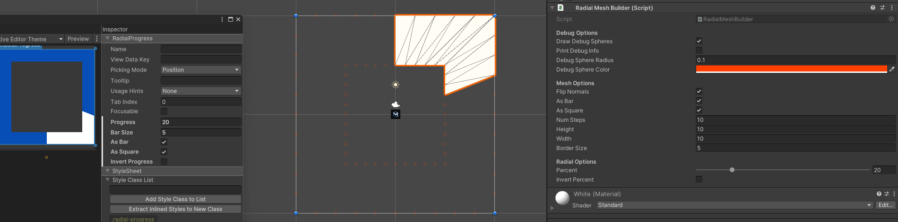

# Radial Progress Bar

Creates a Circle or Square mesh that can be used as a progress indicator. Such as a timer or cooldown.

Additionally there is now an easier version for in game and editor. There is a mesh with the UV coordinates set so
that a shader can control the portion that is seen.

I combined the mesh I was making with growing vines from this tutorial https://www.youtube.com/watch?v=LKaEMBLIw9s


If you're using UIElements, Radial Mesh can work fine just flip it around or capitulate and redo the for loops to start at the bottom and work counterclockwise.

Anywhere else, you can use the shader to grow the radial circle. However, there is only the one mesh, and it's bar size can't be changed programatically. You can create new models and set the uv's to work with the grow mesh. Just make certain they're aligned from bottom to top. The shader can be used for other models as well.

The GrowShader uses the Sub Graph GrowMesh, so you can create shaders as your normally would for textures or patterns and just include the SubGraph to animate the growth.

## Usage

### Generate Mesh
```csharp
mesh = new RadialMesh(NumSteps, FlipNormals);
mesh.Width = Width;
mesh.Height = Height;
mesh.BorderSize = BorderSize;
mesh.AsBar = AsBar;
mesh.AsSquare = AsSquare;
mesh.IsDirty = true;
mesh.UpdateMesh();
```
### Get Vertices
```csharp
IEnumerable<Vector3> vertices = mesh.GetVertices(InvertProgress)
```
### Get Indices
```csharp
ushort[] testIndices = mesh.GetIndices(Progress, InvertProgress)
```

# Online Resources
Online Algorithms: https://rextester.com/CYCBJ87813

# Credits
http://www.code-spot.co.za/2020/11/04/generating-meshes-procedurally-in-unity/

Thanks for showing me how to debug vertices.

# Other Resources
https://docs.unity3d.com/Manual/UIE-radial-progress.html

Used as original framework

# Known Issues

After generating the mesh, the UIElement renders the mesh upside down

